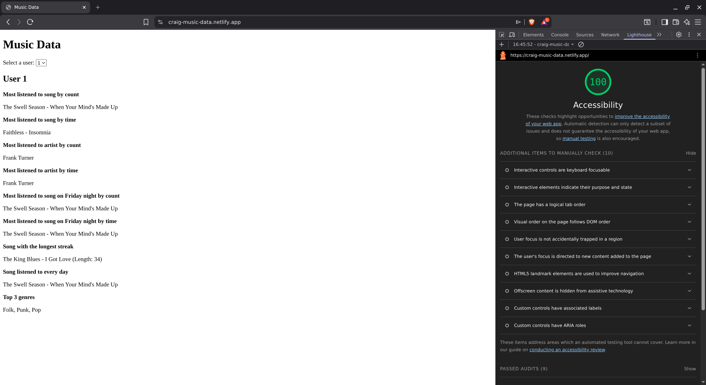

# Rubric

## The website must contain a drop-down which lists four users

When I visit the page, I can see the user selection dropdown

## Selecting a user must display answers relevant to that user

When I visit the page, I can see the data i.e. Q&A for the selected user

## The code written to calculate the answers to the questions must seem like it could handle different data if it were supplied, including the following edge-cases:

### User 4 has no data, so no questions apply to the user. Some intelligible statement should be shown to the user (e.g. "This user didn't listen to any songs")

When I select user 4 from the dropdown, I see a message "User 4 didn't listen to any songs"

### If a question doesn't apply (e.g. if no songs were ever listened to on a Friday night), the interface should completely hide the question and answer

User 3 has not listened to any songs on a Friday night. When I select user 3 from the dropdown, I am unable to see the questions for Friday night.

### If fewer than three (but more than zero) genres were listened to the site should list the top genres listened to. It must not display text like "Top 3 genres", but may say "Top genres" or "Top 2 genres" or similar

- When I select user 1 who has 3 top genres, the text "Top 3 genres" is rendered
- When I select user 2 who has 1 top genre, the text "Top genres" is rendered

## Unit tests must be written for at least one non-trivial function

I have written a unit test for the `mostListenedToSong()` function. It is located in the `common.test.mjs` file

## The website must score 100 for accessibility in Lighthouse

